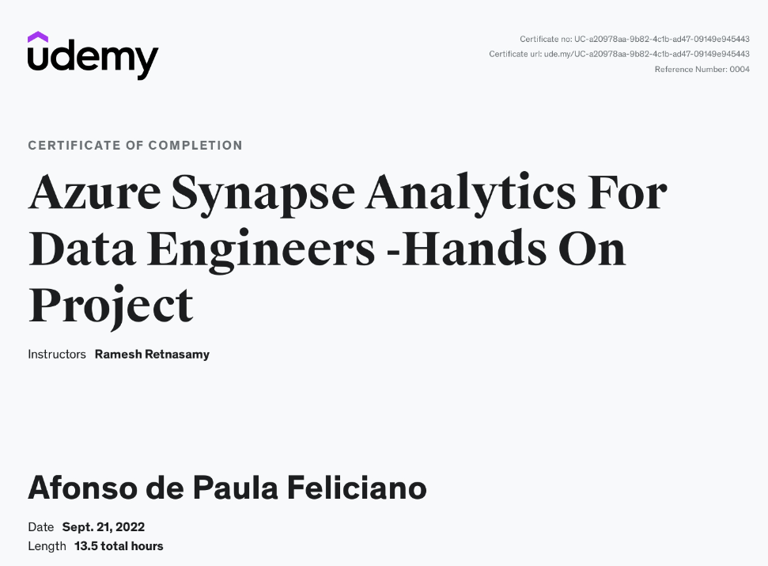

# Azure Synapse Analytics For Data Engineers

## ❗ Sobre o curso

### Objetivo
O objetivo deste curso é realizar um overview geral sobre a ferramente Azure Synapse Analytics (antigo Azure SQL Data Warehouse) implementando soluções de big data em um projeto real com dados abertos. 

### 👨‍💻 Sobre o Autor

O repositório original pertence ao professor Ramesh Retnasamy no qual é especialista em Arquitetura, Design, Desenvolvimento e Implementação de projetos de engenharia de dados e machine learning, atuando com Tecnologia da Informação desde 2002. 

LinkedIn: https://www.linkedin.com/in/ramesh-retnasamy/

### 💰 Adquirindo o curso

O curso pode ser adquirido em: https://www.udemy.com/course/azure-synapse-analytics-for-data-engineers/

## 📄  que é abordado

O curso demonstra a utilização da ferramenta Azure Synapse Analytics em cases reais realizando a execução de um projeto real utilizando dados da NYC Taxi Trips Data. 

É possível visualizar os conceitos e aplicação dos tipos de Pool do Synapse, sua aplicação em diversas arquiteturas, utilização de pipelines, integração com Power BI, Data Lake Storage Gen 2 e Cosmos DB.

## 📄 Estruturação do curso/projeto

Sua estruturação consiste em: 

1. Introdução geral
2. Realização de Subscription na Azure
3. Overview sobre o Synapse Analytics
4. Overview sobre o projeto abordado com os dados da NYC Taxi
5. Overview sobre o SQL Pool Serverless
6. Leitura de arquivos CSV via query
7. Leitura de arquivos JSON via query
8. Leitura de diretórios e múltiplos arquivos via query
9. Leitura de arquivos colunares via query
10. Discovery de dados
11. Virtualização de dados
12. Ingestão de dados
13. Transformação de dados
14. Criação de pipelines e triggers
15. Pool em Spark
16. Integração com Power BI
17. Synapse Link/HTAP para utilização de Cosmos DB
18. Pool dedicado de SQL

## 👨‍🎓 Conclusão

Foi possível adquirir muitos conhecimentos e entender a aplicabilidade do Azure Synapse Analytics em diversas arquiteturas visto que esta ferramenta pode ser considerada um canivete suiço, sendo possível trabalhar em processos batch ou streaming além de integração com diversas API, ferramentas de visualização de dados e até mesmo utilização em otimização de bancos de data warehouse. 

 

Link do certificado: https://www.udemy.com/certificate/UC-a20978aa-9b82-4c1b-ad47-09149e945443/